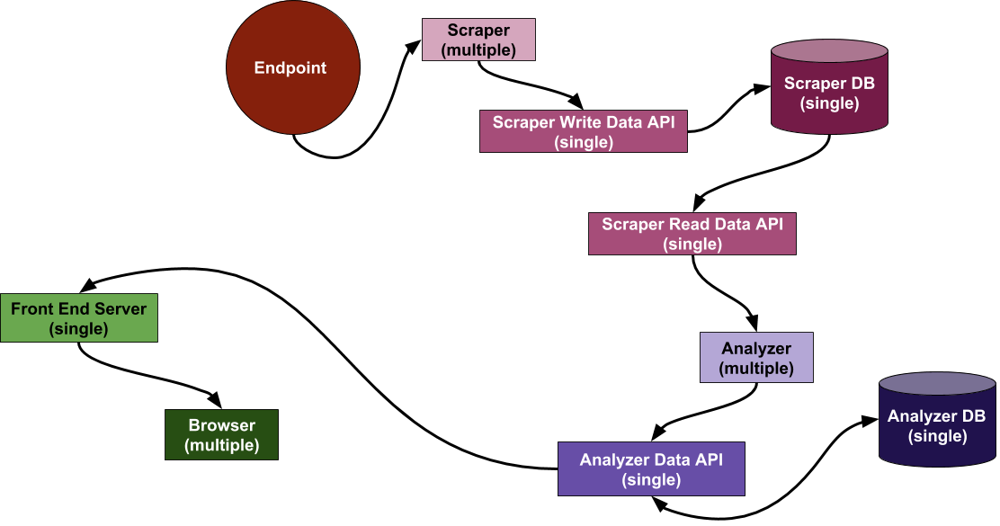

# DataFlow

1. **Scraper** - multiple with different IPs to avoid getting blocked by **Endpoint**
1. **Scraper Write Data API** - single in order to be able to determine local memory if the data to write is duplicate. If multiple instances are required, determination of duplicity may be done through database query.
1. **Scraper DB** - single in order to avoid inconsistencies. It will be an in-memory cache and have memory limit and timeout.
1. **Scraper Read Data API** - single since read request frequency should not be overhealming. Can be multiple if required. It is separate from **Scraper Write Data API** because it may have to be multiple, while **Scraper Write Data API** remains single.
1. **Analyzer** - multiple spark workers.
1. **Analyzer data API** - single, but can be scaled up to multiple, if required.
1. **Analyzer DB** - single, but can be scaled up to multiple, if required.
1. **Front End Server** - single, but can be scaled up to multiple, if required.
1. **Browser** - multiple for trivial reasons.